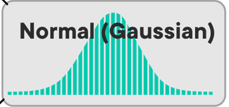
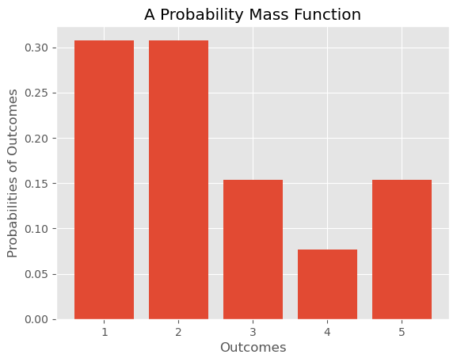
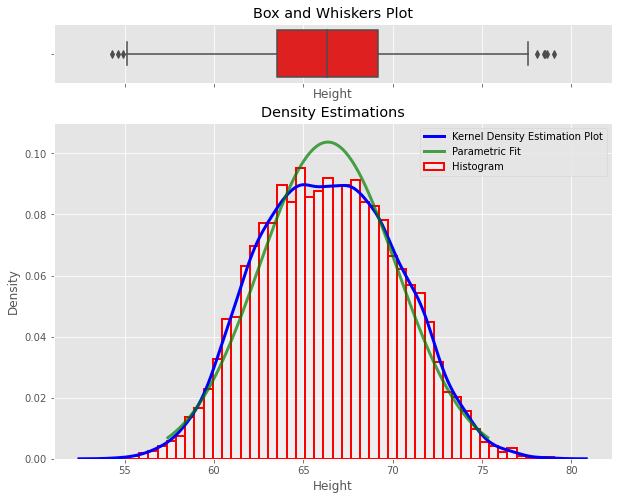
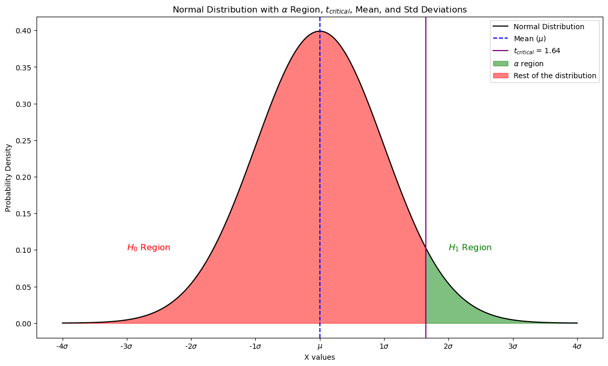

## Common Distributions

# Cheat Sheet DS Phase 2 - Statistics & SQL

## Statistics

  

### Population vs Sample

|                        | **Population**  | **Sample**      | **Sample Formula**                                                          |
|------------------------|-----------------|-----------------|-----------------------------------------------------------------------------|
| **Set**                | Universal       | Subset          |                                                                             |
| **Type**               | Descriptive     | Inferential     |                                                                             |
| **Number/Count**       | $N$             | $n$             |                                                                             |
| **Mean**               | $\mu$ (mu)      | $\bar{x}$ (x-bar)| $\bar{x} = \frac{1}{n} \sum_{i=1}^{n} x_i$                                   |
| **Std Deviation**      | $\sigma$ (sigma)| $s$             | $s = \sqrt{\frac{1}{n-1} \sum_{i=1}^{n} (x_i - \bar{x})^2}$                  |
| **Variance**           | $\sigma^2$      | $s^2$           | $s^2 = \frac{1}{n-1} \sum_{i=1}^{n} (x_i - \bar{x})^2$                       |
| **Proportion**         | $P$             | $p$             | $p = \frac{x}{n}$                                                           |
| **Standard Error**     |                 | $SE$            | $SE = \frac{s}{\sqrt{n}}$                                                   |
| **Correlation Coeff.** | $\rho$ (rho)    | $r$             | $r = \frac{1}{n-1} \sum_{i=1}^{n} \left( \frac{x_i - \bar{x}}{s_x} \right) \left( \frac{y_i - \bar{y}}{s_y} \right)$ |

  

### Discrete - Probability Mass Function (PMF)

| **Distribution**      | **Description**                                                                 | **Example**                         | **Image** |
|-----------------------|---------------------------------------------------------------------------------|-------------------------------------|-----------|
| **Bernoulli**         | Probability of success in a single trial (two outcomes: success/failure)        | Coin toss (p = 0.5)                 |  |
| **Poisson**           | Probability of $n$ events in a fixed interval with a constant mean rate         | Number of emails received per day   |  |
| **Uniform (Discrete)**| All outcomes are equally likely within a set range                              | Rolling a fair die (1-6)            |  |

### Continuous Distributions - Probability Density Function (PDF)

| **Distribution**      | **Description**                                                                 | **Example**                         | **Image** |
|-----------------------|---------------------------------------------------------------------------------|-------------------------------------|-----------|
| **Normal (Gaussian)** | Bell-shaped curve; mean and standard deviation describe the distribution        | Heights, test scores                |  |
| **Uniform (Continuous)**| All outcomes are equally likely within a continuous range                     | Random number between 0 and 1       |  |
| **Student's T**       | Distribution used in small sample sizes for estimating the population mean      | t-test scores                       |  |
| **Chi-Squared**       | Distribution of the sum of the squares of k independent standard normal variables| Goodness of fit test                |  |

### Probability Mass Function (PMF)

| **Concept**  | **Description**                                                                                                                                                 |
|--------------|-----------------------------------------------------------------------------------------------------------------------------------------------------------------|
| **PMF**      | Maps a probability $P(X = x)$ of observing an outcome $x$ of a discrete random variable $X$.                                                                    |
| **Formula**  | $f(x) = P(X = x)$                                                                                                                                                |
| **Range**    | $R_X = \{ x_1,x_2,x_3,\ldots \}$                                                                                                                                |
| **Example**  | For a dice roll: $P(3) = \frac{1}{6}$                                                                                                                           |
| **Intuition**| Probability is calculated as frequency expressed as a fraction of the sample size.                                                                              |
| **Steps**    | 1. Get frequency of each value 2. Divide each frequency by the total number of values                                                                         |
| **Calculation** | <code>frequency = counter[x_i]   total_number = len(x)   return frequency / total_number</code> |
| **PMF Plot** | Use a bar graph to show the PMF.                                                                                                                                 |
| **Expected Value** | $\mu = E(X) = \sum_i p(x_i)x_i$    <code>mu = sum([p(x_i) * x_i for x_i in outcomes])</code>                                                                                    |
| **Variance**       | $\sigma^2 = \sum_i p(x_i)(x_i - \mu)^2$   <code>variance = sum([p(x_i)*((x_i - mu)**2) for x_i in outcomes]) </code>                                                                         |

### Probability Density Function (PDF)

| **Concept**            | **Description**                                                                                                                 |
|------------------------|---------------------------------------------------------------------------------------------------------------------------------|
| **PDF**                | Models probability of continuous random variables.                                                                              |
| **Continuous Variables**| Can take any real value (e.g., height, weight).                                                                                 |
| **Formula**            | $f(x) = \text{PDF}(X = x)$                                                                                                       |
| **Probability vs. Density** | Probability of exact value is 0; use intervals.  Ex. The probability to get 80 degrees is 0 but the probability to get between 79 and 80 degrees is 5%                                                                            |
| **Plots** | The normal distribution, looks like a bell curve.                                                                            |
| **Interpretation**     | Probability is calculated over a range of values using integrals.                                                                |
| **Expected Value**     | $\mu = E(X) = \int_{- \infty}^{+ \infty} p(x)x dx$                                                                               |
| **Variance**           | $\sigma^2 = E((X-\mu)^2) = \int_{- \infty}^{+ \infty} p(x)(x-\mu)^2 dx$                                                          |
| **Visualization**      | Use histograms and density plots (KDE).                                                                                          |
| **Example**            | Density plot for height data:   <code>sns.histplot(data.Height, stat="density")  sns.kdeplot(data.Height)</code>        |

### Cumulative Distribution Function (CDF)

| **Concept**        | **Description**                                                                                                                                                   |
|--------------------|-------------------------------------------------------------------------------------------------------------------------------------------------------------------|
| **CDF**            | The y-axis is  the probability that the random variable $X$ is less than or equal to a certain value $x$, where $x$ is a value on the x-axis.                                                        |
| **Formula**        | $F(x) = P(X \leq x)$                                                                                                                                               |
| **Usage**          | Overcomes limitations of PMFs and PDFs by allowing probability calculations over ranges.                                                                           |
| **Calculation**    | $P(a \leq X \leq b) = F(b) - F(a)$                                                                                                                                 |
| **Interpretation** | CDFs are smooth curves for continuous variables and step functions for discrete variables.                                                                         |
| **Example**        | Probability of throwing a value $\leq 4$ with a dice: $0.6667$.   Probability temperature in NYC $\leq 79$ degrees: 0.4%.                                      |

### Normal Distribution

| **Concept**                  | **Description**                                                                                                                                                                 |
|------------------------------|---------------------------------------------------------------------------------------------------------------------------------------------------------------------------------|
| **Definition**               | The normal distribution, aka the Gaussian distribution, is a continuous probability distribution.                                      |
| **Characteristics**          | - Symmetrical around the mean - Mean, median, and mode are equal - Defined by mean ($\mu$) and standard deviation ($\sigma$) - Total area under the curve is 1            |
| **Formula**                  | $N(x) = \dfrac{1}{\sigma \sqrt {2\pi }}e^{-\dfrac{(x-\mu)^2}{2\sigma^2}}$                                                                                                       |
| **Parameters**               | - Mean ($\mu$): Central value - Standard Deviation ($\sigma$): Spread of the distribution                                                                                      |
| **Properties**               | - 68% of data within 1$\sigma$ of mean - 95% of data within 2$\sigma$ of mean - 99.7% of data within 3$\sigma$ of mean (Empirical rule)                                      |
| **Real World Examples**      | - Human heights - IQ scores - Measurement errors - Natural phenomena                                                                                                    |
| **Why Popular?**             | - Ubiquity in natural phenomena - Central Limit Theorem: Sum of many independent random variables tends towards a normal distribution - Simplified computation                |
| **Python Usage**             | Generate normal distribution with NumPy:  <code>mu, sigma = 0.5, 0.1 n = 1000 s = np.random.normal(mu, sigma, n) sns.displot(s);</code>                                 |

### Standard Normal Distribution

| **Concept**        | **Description**                                                                                                                                                   |
|--------------------|-------------------------------------------------------------------------------------------------------------------------------------------------------------------|
| **Definition**     | A special case of the normal distribution with a mean of 0 and a standard deviation of 1.                                                                          |
| **Formula**        | $z = \dfrac{x - \mu}{\sigma}$                                                                                                                                     |
| **Properties**     | - Mean ($\mu$) = 0   - Standard Deviation ($\sigma$) = 1   - 68% within 1 standard deviation   - 95% within 2 standard deviations   - 99% within 3 standard deviations |
| **Usage**          | Standardizes data for comparison across different normal distributions.                                                                                            |
| **Z-score**        | Reflects the number of standard deviations an observation is from the mean.  **It is the value on the x-axis.**                                                                                        |
| **Example**        | Test score: $\mu$ = 50, $\sigma$ = 10, $x$ = 70   $z = \dfrac{70 - 50}{10} = 2$ (2 standard deviations above the mean)                                           |
| **Data Standardization** | Converts different distributions to a common scale:   <code>standardized = [(x - d.mean())/d.std() for x in d]</code>                                       |

### Central Limit Theorem

| **Concept**                | **Description**                                                                                                                                       |
|----------------------------|-------------------------------------------------------------------------------------------------------------------------------------------------------|
| **Definition**             | States that the sum of a large number of independent random variables will approximate a normal distribution, regardless of the original distribution. |
| **Sampling**               | Sample averages will form a normal distribution as sample size increases.                                                                             |
| **Parameter Estimation**   | Allows estimation of population parameters using sample statistics.                                                                                   |
| **Application**            | Used to assess the probability of sample means deviating significantly from the population mean.                                                      |
| **Example**                | Comparing asthma rates in a specific city to the national average to determine if differences are statistically significant.                           |
| **Empirical Rule**         | - 68% of data within 1 standard deviation - 95% within 2 standard deviations - 99.7% within 3 standard deviations                               |

### Confidence Intervals with T-Distribution

| **Concept**                  | **Description**                                                                                                                                                                 |
|------------------------------|---------------------------------------------------------------------------------------------------------------------------------------------------------------------------------|
| **T-Distribution**           | Used instead of the normal distribution when the population standard deviation is unknown and the sample size is small.                                                         |
| **Degrees of Freedom**       | Degrees of freedom (df) for the t-distribution is the sample size minus the number of estimated parameters. For estimating the mean, df = \( n - 1 \).                           |
| **\( \alpha \)**             | Significance level, the probability that the true parameter lies outside the confidence interval. For a 95% confidence interval, \( \alpha = 0.05 \).                           |
| **\( t \)**                  | Represents the t-value from the t-distribution.                                                                                                                                  |
| **t-value**                  | The number of standard deviations away from the mean of the t-distribution.                                                                                                     |
| **\( t_{\alpha} \)**         | Part of the critical value from the t-distribution corresponding to the significance level \( \alpha \).                                                                                     |
| **\( t_{\alpha/2} \)**       | Part of the critical value from the t-distribution for a two-tailed test, corresponding to \( \alpha/2 \).                                                                                   |
| **\( t_{\alpha/2, n-1} \)**  | Critical value from the t-distribution with \( n-1 \) degrees of freedom for a two-tailed test.                                                                                   |
| **t-Critical Value**         | The t-critical value is a point on the x-axis of the t-distribution. It represents the number of standard deviations away from the mean needed to capture the desired confidence level. For a 95% confidence level, it marks the boundaries within which 95% of the sample means would fall. |
| **Formula**                  | $\bar{x} \pm t_{\alpha/2,n-1}\left(\dfrac{S}{\sqrt{n}}\right)$                                                                                                               |
| **Key Terms**                | $\bar{x}$: Sample mean $\dfrac{S}{\sqrt{n}}$: Standard error of the mean $t_{\alpha/2, n-1}$: Critical value from t-distribution for desired confidence level and degrees of freedom $t_{\alpha/2,n-1}\left(\dfrac{S}{\sqrt{n}}\right)$: Margin of error |
| **Example Calculation**      | Given a sample of cholesterol levels:   Sample mean (\( \bar{x} \)): 63.25 (mean)   Sample standard deviation (\( S \)): 18.29 (std dev)   Sample size (\( n \)): 20   Standard error (\( SE \)): \( \dfrac{S}{\sqrt{n}} = \dfrac{18.29}{\sqrt{20}} = 4.09 \) (std error)     Calculate the critical value for a 95% confidence level with \( n-1 \) degrees of freedom: Look up \( t_{0.025, 19} \) in the t-distribution table or use statistical software: \( t_{0.025, 19} \approx 2.093 \)     Calculate the margin of error: \( t_{\alpha/2, n-1} \times SE = 2.093 \times 4.09 = 8.56 \)     Confidence interval: \( \bar{x} \pm \text{Margin of Error} = 63.25 \pm 8.56 = (54.69, 71.81) \) |
| **Python**      | `t_critical = stats.t.ppf(1 - alpha/2, df=n-1)`  |

### Statistical Significance

| **Concept**                   | **Description**                                                                                                                                                                 |
|-------------------------------|---------------------------------------------------------------------------------------------------------------------------------------------------------------------------------|
| **Confidence Level**          | The probability that the true population parameter will fall within the confidence interval. Common levels are 90%, 95%, and 99%.                                                |
| **Significance Level (\( \alpha \))** |  \( \alpha \) = 0.05 (5%) most commonly. This means that we accept there's a 5% chance of our data being wrong by chance. If we pass this threshold (by our p-value being smaller than $a$), our alternative hypothesis is true (a positive result), and we reject the null hypothesis. It's the area under the distribution curve on the tail where the percent is equal to \( \alpha \).|
| **Hypothesis Testing**        | Involves making a claim (alternative hypothesis) and testing it against the default assumption (null hypothesis).                                                               |
| **Trade-off Between Correctness and Utility** | A higher \( \alpha \) will be less likely to give false negatives but causes more false positives. A lower \( \alpha \) reduces false positives but gives more false negatives. For example, if we say 100% of the distribution is our interval, we will never be wrong and give no useful information. But if we say a super narrow range of the distribution is our interval, we'll almost never find a case where the event falls into it.  |
| **Confidence Interval (CI)**  | A range of values that is likely to contain the true population parameter. Wider intervals correspond to higher confidence levels.                                               |
| **Python Method (scipy.stats)** | Use `stats.t.interval(alpha, df, loc, scale)` to calculate the confidence interval. Example: `stats.t.interval(0.95, df=len(sample)-1, loc=np.mean(sample), scale=stats.sem(sample))`. |
| **loc Parameter**             | The mean of the sample data. It represents the central value (mean) around which the confidence interval is calculated. Example: `loc=np.mean(sample)`. |
| **stats.sem**                 | The standard error of the mean, calculated as the sample standard deviation divided by the square root of the sample size. It represents the spread of the sample mean. Example: `stats.sem(sample)`. |

## Additional Sections

### Section 1: [Title]
Add your content here...

### Section 2: [Title]
Add your content here...
